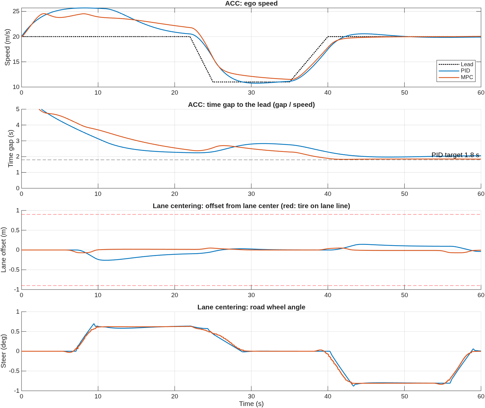

# ACC and lane centering: PID vs MPC

**Goal.** EcoCAR Year 1 CAV controls: a simulated car that stays in its lane and follows a
lead vehicle without hitting it.

**Setup.** Vehicle Dynamics Blockset bicycle model (2000 kg sedan). The 1.4 km road has a 250 m
left curve and a 200 m right curve with 60 m clothoid transitions. The lead starts out of radar
range at 20 m/s, brakes to 11 m/s at 3 m/s², then returns to 20 m/s. Set speed 25 m/s.

| | PID | MPC |
|---|---|---|
| ACC | gap PD → speed PI → force | MPC toolbox ACC block → accel → force |
| Lane centering | PID on `ey + L sin(epsi)` | MPC toolbox lane keeping, 2 s curvature preview |
| Max lane offset (lane line at 0.90 m) | 0.26 m | 0.07 m |
| Min time gap (target 1.8 s) | 1.97 s | 1.83 s |
| Peak braking | 2.6 m/s² | 2.9 m/s² |
| Max speed (set 25 m/s) | 25.7 m/s | 24.6 m/s |

Both pass. MPC centers about 4× better because it sees each curve 2 s ahead; PID only reacts
once an error appears. PID is simpler to explain and tune, and it overshoots the set speed slightly.

**Pitfalls worth showing in the video.**
- The vehicle block's default tire stiffness lets a sedan slide at 8°. Stiffness is per tire.
- A discrete PID's default derivative filter made the force command flip sign every 20 ms step (N·Ts = 2).
- MPC treats the spacing policy as a hard minimum, not a target. At the 1.8 s time gap it rode
  the constraint into 4 m/s² brake spikes. A 1.5 s minimum plus a 0.15 s modeled acceleration lag
  (matching this car) fixes it, and the MPC then follows at about 1.85 s.
- Instant curvature steps (no clothoid) made MPC steering spike to 136°/s; with clothoids, 3°/s.

**Next.** Radar and lane-camera noise and delay, steering actuator dynamics, a lead cut-in,
RoadRunner scenes, and code generation for the CAV controller.
